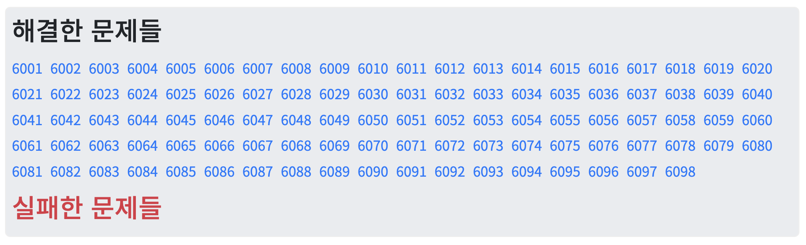

코드업 파이썬 기초100제를 모두 풀었다. 6051~6098</b>로 나눠서 복습한 내용을 정리했다.

> 📌 [코드업 기초 100제 6001 ~ 6050](https://gyutato.github.io/Algorithm/Codeup/Basic100_1) 에서 이어지는 글입니다.


## 04. 기초 - 논리연산

#### 6052

- 프로그래밍 용어: "**평가**"
    - 식이나 값을 계산해서 결과값이 만들어지는 것을 평가(evaluate)라고 한다.
    - `bool()`을 이용하면 식이나 값을 평가해 `bool` 자료형의 값을 출력해준다.
    - `bool()` 평가값을 다루는 예약어로 `not`, `and`, `or`이 있다.
        - 이 예약어를 사용한 연산을 **논리연산**이라고 하며, 그 결과 역시 `True` 또는 `False`로 계산된다.

#### 6056

- `XOR` 연산
    - 참 거짓이 서로 다를 때에만 `True` 로 계산하는 논리연산을 `XOR`(exclusive or, 배타적 논리합) 연산이라고도 부른다.

```python
c = bool(int(a))
d = bool(int(b))
print((c and (not d)) or ((not c) and d)) # XOR
```

#### 6058

- `not` 연산
    - `not A and not B == not(A or B)`
    - 파이썬에서는 `and`, `or`, `not`이 연산자다.
        - C언어에서는 값, 변수, 함수 앞에 `!`를 붙이면 NOT 연산이 된다. 각각 AND, OR 연산에 해당하는 `&&`, `||` 기호도 마찬가지. (이게 더 편한데 ㅜㅜ)

```python
a, b = map(int, input().split())
print(not(bool(a) or bool(b)))
```

#### 6059

- `bitwise not` 연산: `~`
    - 예를 들어 1이 입력되었을 때 저장되는 1을 32비트 2진수로 표현하면 `00000000 00000000 00000000 00000001` 인데, 이 때 `~1`은 `11111111 11111111 11111111 11111110` 가 되며 -2를 의미한다.
    - 파이썬에서도 C와 마찬가지로 양의 정수는 2진수 형태로 바뀌어 저장되고, 음의 정수는 **2의 보수 표현** 방법으로 저장된다.
        - 각각 양의 정수, 음의 정수이면서 두 수의 절댓값은 동일한 경우 더하면 0이 되어야 한다. 2진수 하에서, 한 2진수와, 그 수의 비트를 뒤집은 2진수를 더하면 무조건 모든 자리의 숫자가 1이 된다. 
        - 거기다 1을 더하면 모든 자리가 받아올림되어 0이 되고, 자릿수가 하나 늘어나며 맨 앞자리 숫자만 1이 된다.
        - 이 때 늘어난 맨 앞자리 숫자, 1은 자료형의 범위를 벗어났을 것이므로 버려져서, 결국 모든 자리에 0만 남는다.
        - 그래서 2 의 보수 표현 체계 하에서 어떤 수의 부호를 바꾸려면 먼저 비트를 반전 시킨 뒤에 1 을 더하면 된다.
    - 이러한 내용을 간단히 표현하면, 정수 n이라고 할 때,
        - `~n` = `-n - 1`
        - `-n` = `~n + 1` 이다.

#### 6060

- `bitwise and` 연산: `&`
    - 비트단위 and 연산은 두 비트열이 주어졌을 때, 둘 다 1인 부분의 자리만 1로 만들어주는 것과 같다.
    - 이러한 비트단위 연산은 마스크연산(특정 부분을 가리고 출력하는)을 수행하는 데에도 효과적으로 사용된다.
        - 예를 들어, 네트워크에 연결되어 있는 두 개의 컴퓨터가 데이터를 주고받기 위해 **같은 네트워크에 있는지 아닌지를 판단**하는데 사용되고 있다.
    - 비트단위 or 연산은 연산자 `|`를 사용하며, 두 비트열이 주어졌을 때 둘 중 하나라도 1인 부분의 자리를 1로 만든다.

#### 6062

- `bitwise xor` 연산: `^`
    - 비트단위 xor 연산은 두 비트열이 주어졌을 때, 서로 다른 부분의 자리만 1로 만들어주는 것과 같다.
    - 예를 들면:
        - 3: 00000000 00000000 00000000 00000011
        - 5: 00000000 00000000 00000000 00000101
        - 3 ^ 5 : 00000000 00000000 00000000 00000110
    - 이러한 xor 연산을 사용한 예시는 다음과 같다:
       - 두 장의 이미지가 겹쳐졌을 때 색이 서로 다른 부분만 처리할 수 있다.
        - 배경이 되는 그림과 배경 위에서 움직이는 그림이 있을 때, 두 그림에서 차이만 골라내 배경 위에서 움직이는 그림의 색으로 바꿔주면 전체 그림을 구성하는 모든 점들의 색을 다시 계산해 입히지 않고 보다 효과적으로 그림을 처리할 수 있게 되는 것이다.
    
<br/>

## 05. 기초 - 삼항연산

#### 6063

- 파이썬의 삼항 연산자: `[true_value] if [condition] else [false_value]`
```python
# C, JS 포함 다수 언어의 삼항 연산자 형태
[condition] ? [true_value] : [false_value]

# 파이썬의 삼항 연산자 형태
[true_value] if [condition] else [false_value]
```
- 파이썬의 삼항 연산자는 조금 더 영어식 표현이며 true_value값이 더 앞쪽에 위치한 것이 특징이다.

#### 6064
```python
# 세 정수 a, b, c 중 가장 작은 값을 출력, 삼항 연산자를 사용

a, b, c = map(int, input().split())
min = (a if a < b else b) if (a if a < b else b) < c else c
print(min)
```

1. `a`와 `b`를 비교한다.
2. 비교 결과(`a`와 `b` 중 작은 값)가 `c`보다 작다면, 그 값을 `min`값으로 삼는다.
3. 그렇지 않다면, `c`가 `min`값이다.

- **프로그래밍 언어 소스코드 작성**시 모든 요소들은: 
    - "순서에 따라 한 단계씩 실행"
    - "미리 정해진 순서에 따라 하나씩 연산 수행"
    - "그 때까지 연산된 결과를 이용해 다시 순서에 따라 하나씩 연산" 등의 원리가 적용된다. 
    - 따라서 3항 연산을 중첩해(괄호로 묶는 등..) 이용하면 여러 값들을 순서대로 비교해 가장 큰/작은 값을 계산할 수 있다.

- **어떤 순서**에 따라 계산될 지 생각해보고, 여러 가지 연산자가 동시에 사용된 식이 있을 때 어떤 우선순위에 따라 순서대로 계산이 되는지 찾아보도록 한다.

<br/>

## 06. 기초 - 종합

#### 6081

- `format()` 함수가 적용되는 `{ }` 안에 진법을 명시할 수 있다. 
    - 당연히 `format({숫자}, '{진법}')` 형태로도 가능하다.

#### 6091

- **(유사)** 최소공배수
```python
a, b, c = map(int, input().split())

day = 1
while (day % a or day % b or day % c):
    day += 1

print(day)
```

- 원래는 **유클리드 호제법**을 사용해서 최대공약수를 구한 후 이것을 가지고 최소공배수를 구했었다.
    1. 유클리드 호제법으로 최대공약수를 구한다.
        - 처음에 주어진 두 수 중 큰 수를 작은 수로 `mod`연산한다.
        - 나눈 값(두 수 중 작은 수)와 `mod`연산의 결과(나머지)를 다시 `mod`연산한다.
        - `mod`연산의 결과가 0이 될때까지 반복한다.

        ```python
        def gcd(x, y):
        if y == 0:
            return x
        else:
            return gcd(y, x % y)
        ```
    
    2. 최대공약수를 이용해서 최소공배수를 구한다.
        - 두 수의 곱을 최대공약수로 나눈 몫이 최소공배수다: `lcm = (x * y) // gcd(x * y)`
            - 각 수를 소인수분해 했을때, 최대공약수는 각 수의 소인수 다중집합 간의 교집합이다.
            - 두 수를 곱하면, 최대공약수만큼이 두 번 곱해지고, 나머지는 한 번씩 곱해진다.
            - 따라서 두 수를 곱한 후 최대공약수로 한 번 나누어 주면 두 수의 최소공배수를 구할 수 있다.

- 다만 시간복잡도를 생각하지 않는다면, 위의 방법이 아니라 그냥 1부터 1씩 증가시켜 가면서 주어진 두 수로 나누었을 때 모두 나머지가 0인지 판단하면 간단하다.
    - 즉 경우에 따라 <u>주어진 두 수가 작다거나 하는 이유로</u> 간단한 코드가 더 유리한 경우라면 단순한 코드로 해결하는 것이 더 효율적일 수도 있다는 점을 기억하자.

#### 6092

- 리스트 0으로 초기화: `arr = [0 for _ in range(n)]`
    - 리스트 내포: `arr = [{표현식} for {항목} in {반복가능 객체} if {조건문}]`

#### 6093

- 배열 뒤집기
    1. `reverse()`
        - `list`의 메소드
            - `list.method()` 형태로 사용되는 것
        - **원본 리스트의 순서를 바꾼다**
    2. `reversed()`
        - 파이썬의 내장함수
            - 메서드가 아니라 함수다
            - 주어진 시퀀스 **(리스트, 튜플 등)**에 대해 순서가 뒤집어진 **`iterator` 객체**의 형태로 반환한다
            - 내장함수 `list()`를 이용해서 리스트 자료형으로 변환해야 한다
        - **원본 리스트의 순서를 바꾸지 않는다**
    3. 리스트 슬라이싱: `{리스트명}[::-1]`

#### 6095

- 2차원 배열의 행열 순서
    - `arr[y][x]` : `y`번째 행의 `x`번째 열
        - 2차원 배열의 각 요소(리스트)를 한 **행**으로 생각할 때.
            - 즉 행을 고정하고 열을 움직이고 싶으면 `x`를 조작해야 한다.
            - 열을 고정하고 행을 움직이고 싶으면 `y`를 조작해야 한다.
        - 각 리스트를 한 **열**로 생각할 수도 있다. 
        - 출력할 때 어떤 식으로 할지 생각해 보고 알아서 하면 되지 않을까? 근데 보통 그럴 일이 잘 없을 것 같다.