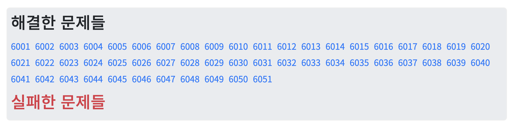

## 00. 코드업 파이썬 기초 100제 🐥

라피신에서 만난 <b>mjk</b>님(스승님 😊)이 후루룩 풀기 좋다고 추천해주신 코드업 기초100제!

후루룩 풀면서 잃어버렸던 파이썬 감을 다시 잡았다.

다만 생각보다도 더 쉬웠다. 정말 기초 수준, 1학년 1학기 때 들었던 코딩 교양 한 1~5주차에 풀었을 법한 문제 수준이다.

그냥 하루정도 뇌 비우고 하다 보면 끝낼 수 있음!

그래도 뭐라도 공부했다는 기록은 남겨야지 싶어 **6001 ~ 6050**, **6051 ~ 6098**로 나눠서 복습한 내용을 정리했다.

<br/>

## 01. 기초 - 입출력

#### 6015
- 입력값 여러 개를 구분자 기준으로 자르기
    - `split(sep='{구분자}', maxsplit={분할횟수})`
- 입력값 여러 개를 한번에 형변환하기
    - `map({자료형}, {입력값(인자)})`

#### 6018
- 출력되는 문자열의 구분자, 종료문자 조작 : `print()` 함수의 옵션
    - `print(sep='{구분자}', end='{종료문자}')`

#### 6018
```py
s = input()
for i in range(0, 5, 2):
    print(s[i:i+2], end=' ')
```
- `for`문 반복 간격
    - `range()`함수의 인자로 제어할 수 있음
    - `range(start, stop, step)`
- 문자열 인덱싱
    - `s[a:b]` 라고 하면, `s`라는 단어에서 `a`번째 문자부터 `b - 1`번째 문자까지 잘라낸 부분을 의미한다.

<br/>

## 02. 기초 - 값변환

#### 6029
- 정수의 진법 변환
    - `int(value, base)`

#### 6030
- 문자 - 아스키코드 간 변환 함수
    - `ord(char)`: Return the Unicode code point for a one-character string.

    - `chr(int)`: Return a Unicode string of one character with ordinal `int`.
        - 0 <= `int` <= 0x10 ffff

#### 6042
- 문자열 포맷팅 : `format()`
    - 문자열 사이사이 변수로 표현될 수 있는 값이 들어갈 때, 값을 직접 적는 대신 변수의 값을 사용할 수 있도록 하는 방법
    - `format` 함수는 중괄호 `{ }` 안에 포매팅을 지정하고 `format `함수의 인자로 값들을 넣는다.
    - 정수, 실수 형태 및 자릿수를 지정할 수 있다.
        - 정수: 0`N`, 소수: 0.`N`
        - 정수: `d`, 실수: `f`
    - 인덱스 뒤 콜론을 붙여 몇 가지 옵션을 줄 수 있다:
        - 문자열 정렬하기: `<`, `>`, `^`
        - 자릿수: 숫자 입력
        - 공백이 아닌 값 채우기: `<`, `>`, `^` 기호 앞에 특정 문자를 입력
    - 그냥 `format` 함수만 print문 안에 사용할 수도 있다.
        - `format({수}, "{형태}")`
        - ex) `print(format(n, "0.2f"))`

```python
print('this is {0:+<10}'.format('left', 'a'))
# 출력: this is left++++++
```

<br/>

## 03. 기초 - 비트시프트연산

#### 6046

- 정수를 2배 혹은 1/2배 곱할 때에는 비트단위 시프트 연산자를 사용하여 빠르게 연산할 수 있다.
- 모든 값들은 2진수 형태로 변환되어 컴퓨터 내부적으로 처리되기 때문이다.
    - 2진수에서 2를 곱하는 것은 10진수에서 10을 곱하는 것과 같다. 즉 한 자리 늘어난다.
        - 반대로 생각하면, 2진수에다 `<<` 연산으로 오른쪽 끝에 0을 하나 추가하는 것은 2를 곱한 것과 동일하다.
    - 같은 원리로, 1/2를 곱하는 것은 2진수에다 `>>` 연산한 셈이다.

```toc
```