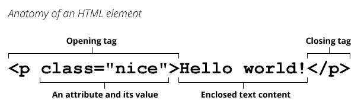
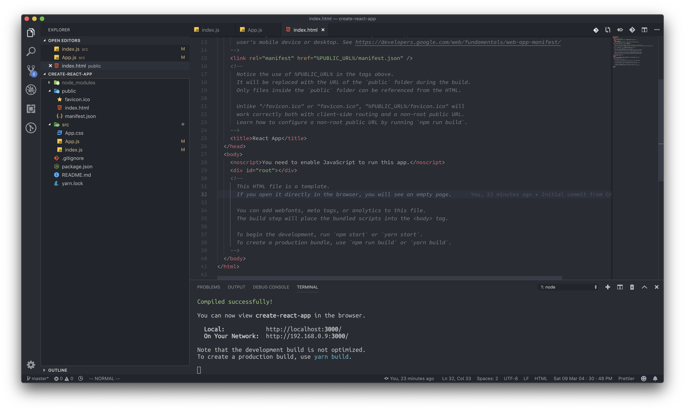

> 📌 [(React) 리액트 공식 자습서 따라하기 1. 개발 환경 셋팅](https://gyutato.github.io/react/react_official/tutorial_1/)에서 이어지는 글입니다.

[조은](https://euncho.medium.com/about) 님의 [프론트엔드 학습 로드맵](https://euncho.medium.com/%ED%94%84%EB%A1%A0%ED%8A%B8%EC%97%94%EB%93%9C-%ED%95%99%EC%8A%B5-%EB%A1%9C%EB%93%9C%EB%A7%B5-91c3bc11dec0)에 따른 첫 번째 스프린트로, [리액트 공식 튜토리얼](https://ko.reactjs.org/docs/hello-world.html) 을 추가로 공부했다.

<br/>

# 🐥 개요 1. React의 개념과 '엘리먼트'
리액트의 뼈대를 이루는 **`엘리먼트`** 와 **`컴포넌트`**, `props` 그리고 `state`를 알아보자 !

여기서는 그 중에서도 사전지식인 React의 개념과 JSX를 짚어보고, **엘리먼트**에 대해 설명한다.

<br/>

## 1. React란 무엇인가?

React는 **"UI를 만들기 위한 JavaScript 라이브러리"** 이다. 그렇다. '라이브러리'다.

- 프레임워크 : 원하는 기능 구현에 집중하여 개발할 수 있도록 **필요한 기능을 갖추고 있는 것**, **일정한 형태**를 가지고 다양한 형태의 결과물을 만드는 것
    
    - 정해진 프로그램의 틀에 맞게 사용자가 필요한 기능을 입력함

- 라이브러리 : 소프트웨어를 개발할 때 프로그래밍 사용하는 비휘발성 자원의 모임, **공통으로 사용될 수 있는 특정한 기능들을 모듈화한 것**

    - 호출하는 개발자가 필요한 기능을 원할 때 호출함

`Angular`, `Vue` 등의 다른 <u>프레임워크</u>와는 달리 `React`는 오직 **View만 담당하는 라이브러리**다. 

```JS
UI = View(State)
```

그래서 UI를 위의 수식과 같이 표현한다면, React가 이 수식의 View 함수에 해당한다고 설명한다. (출처: [JisuPark 님의 medium](https://medium.com/little-big-programming/react%EC%9D%98-%EA%B8%B0%EB%B3%B8-%EC%BB%B4%ED%8F%AC%EB%84%8C%ED%8A%B8%EB%A5%BC-%EC%95%8C%EC%95%84%EB%B3%B4%EC%9E%90-92c923011818))

그 말은, `View`를 <u>**`State`가 같다면 항상 같은 UI를 결과로 갖는 함수**</u>로 본다는 것이다.

이러한 관점에서의 장점은 다음과 같다:

- 함수의 정의가 그러하듯 **단방향 사고**를 강제한다.
- 함수가 그러하듯 특정 `state`, `props`에 따른 `render` 결과가 바뀌지 않는다.
- 함수 내용을 정의하듯 `JSX`를 통해 어떻게 화면을 그릴지 정의한다.
- 함수 간 `합성(Composition)`이 가능하듯이 `컴포넌트` 간 <u>합성</u>을 할 수 있다.

<br/>

## 2. `JSX`와 엘리먼트

```JSX
const element = <h1>Hello, world!</h1>
```

앞선 글에서 말했듯, React는 `JSX` 문법을 사용하여 화면을 구성한다. 이 `JSX`란 자바스크립트에 `XML`을 더한 형태로, 마크업과 로직을 각각 별도의 파일로 구분하는 기존의 방식에서 벗어나 이 둘을 함께 포함하는 각각의 `컴포넌트`들로 프로그램의 각 영역을 구분하는 데 사용된다.

<br/>

### 2-1. 🤷‍♀️ 포함된 표현식도 표현식일 수 있는거임? JSX도?

\* 위 소제목은 본문의 내용과 큰 관련이 없습니다. 그저 JSX와 JS 표현식에 대한 이야기입니다.


<br/>

#### 🪄 JSX에 표현식 포함하기

`JSX`의 특징이자 장점은 마크업 요소 안에 유효한 자바스크립트 표현식(값을 반환하는 식 또는 코드)을 넣을 수 있다는 것이다. 정확히는 **중괄호** 안에는 유효한 모든 자바스크립트 표현식을 넣을 수 있다.

```JSX
function formatName(user) {
  return user.firstName + ' ' + user.lastName;
}

const user = {
  firstName: 'Harper',
  lastName: 'Perez'
};

const element = (
  <h1>
    Hello, {formatName(user)}!
  </h1>
);
```

위 코드는 공식문서에 나와 있는 예시로, 자바스크립트 함수 호출의 결과인 `formatName(user)`을 `<h1>` 엘리먼트에 포함시켰다.

#### 🪄 JSX도 표현식이다

"값을 반환하는 식 또는 코드"라는 **표현식**의 정의를 생각해보자. 표현식은 곧 어떤 값으로 표상되기 때문에 `JSX`에서는 이것을 엘리먼트에 들어갈 값으로 사용할 수 있었다.

같은 관점에서, 자바스크립트 표현식을 사용한 `JSX`는 정규 자바스크립트 함수를 호출하게 되고, 즉 **자바스크립트 객체**로 인식된다. 즉 표현식으로써 `if` 구문 및 `for loop` 안에 사용되고, 변수에 할당되고, 인자와 리턴값으로 사용될 수 있다.

```JSX
function getGreeting(user) {
  if (user) {
    return <h1>Hello, {formatName(user)}!</h1>;
  }
  return <h1>Hello, Stranger.</h1>;
}
```

#### 🪄 JSX 속성(어트리뷰트) 정의

`어트리뷰트`, 즉 속성이란 html 문서에서 엘리먼트에 추가적인 정보를 넣을 때 사용되는 요소다. 

```JSX
const element = <a href="https://www.reactjs.org"> link </a>;
const elementTwo = </img>;
```

위와 같이 어트리뷰트의 값에 문자열 리터럴이나 자바스크립트 표현식을 넣을 수 있다. 
이처럼 `JSX`에서는 **중괄호**를 사용해서 값이 필요한 부분에 <u>자바스크립트 표현식</u>을 넣을 수 있다는 점을 상기하자.

#### 🪄 JSX 트랜스파일

각 `JSX` 엘리먼트는 `React.createElement(component, props, ...children)`를 호출하여 트랜스파일(컴파일)된다. 그래서 사실 `JSX`로 할 수 있는 모든 것들은 순수 자바스크립트로도 구현된다:

```JSX
class Hello extends React.Component {
  render() {
    return <div>Hello {this.props.toWhat}</div>;
  }
}

ReactDOM.render(
  <Hello toWhat="World" />,
  document.getElementById('root')
);
```

위와 같은 `JSX` 코드는 아래와 같은 순수 자바스크립트 코드로 변환될 수 있다.

```JS
class Hello extends React.Component {
  render() {
    return React.createElement('div', null, `Hello ${this.props.toWhat}`);
  }
}

ReactDOM.render(
  React.createElement(Hello, {toWhat: 'World'}, null),
  document.getElementById('root')
);
```

`React.Component`가 무엇인지는 아래에서 후술할 것이다. 지금 눈여겨볼 점은 `<div>Hello {this.props.toWhat}</div>` 라는 하나의 **엘리먼트**가 `React.createElement('div', null, 'Hello ${this.props.toWhat}')` 라는 하나의 함수 호출에 대응된다는 점이다.
- (마크다운 표기로 인해 마지막 인자에 백틱 대신 작은따옴표를 사용했다. 실제로는 중괄호를 사용하기 위해 백틱 기호를 사용해야 한다.)

```JS
React.createElement(
  type, // string | React.createClass()
  [props], // null | object
  [...children] // null | string | React.createClass() | React.createElement()
)
```

`React.createElement`의 기본 형태는 위와 같다. [이 API를 내부적으로 들여다본 글](https://medium.com/react-native-seoul/react-%EB%A6%AC%EC%95%A1%ED%8A%B8%EB%A5%BC-%EC%B2%98%EC%9D%8C%EB%B6%80%ED%84%B0-%EB%B0%B0%EC%9B%8C%EB%B3%B4%EC%9E%90-02-react-createelement%EC%99%80-react-component-%EA%B7%B8%EB%A6%AC%EA%B3%A0-reactdom-render%EC%9D%98-%EB%8F%99%EC%9E%91-%EC%9B%90%EB%A6%AC-41bf8c6d3764)을 찾았는데, 인자를 받아서 아래와 같은 값을 가지는 `ReactElement` 객체로 만들어준다고 한다.

```JS
const ReactElement = function(type, key, ref, self, source, owner, props){ 
    const element = {
        $$typeof : REACT_ELEMENT_TYPE,
        type: type,
        key: key,
        ref: ref,
        props: props,
        _owner: owner,
    }
...
    return element
}
```
즉, `React.createElement`를 통해 엘리먼트에 대한 정보를 가지는 객체를 생성하고, 이를 `In-Memory`에 저장한 후 `ReactDOM.render` 함수를 통해 `Web API(document.createElement)`를 이용해서 실제 웹 브라우저에 그려주는 방식으로 동작한다고 한다. (아직은 이 내용이 조금 어렵다)

<br/>

### 2-2. 🧬 엘리먼트와 React 엘리먼트 렌더링

다시 한 번 엘리먼트에 대해 간단히 짚고 넘어가자. 

#### 🌐 브라우저 DOM 엘리먼트



**엘리먼트**는 웹 페이지의 일부이며, `XML` 혹은 `HTML` 내부에서 텍스트나 이미지의 일부 혹은 데이터 아이템을 가지고 있을 수 있다. 물론 아무것도 가지고 있지 않는 것도 가능하다. 일반적인 엘리먼트는 어트리뷰트(속성)와 함께, 열린 태그로 시작하며 그 내부에 텍스트가 있고 닫는 태그로 끝나게 된다. (참고: [jakeseo-javascript.js](https://velog.io/@jakeseo_me/1-%EC%9B%B9%EB%B8%8C%EB%9D%BC%EC%9A%B0%EC%A0%80%EC%9D%98-DOM%EA%B3%BC-%EA%B8%B0%ED%83%80-%EC%9A%94%EC%86%8C%EB%93%A4))

다만, 위의 도식에서도 알 수 있듯 **엘리먼트**와 **태그**는 동일한 것이 아니다. 태그는 소스코드에서 엘리먼트를 시작하거나 끝내긴 하지만, 엘리먼트는 브라우저에서 페이지를 보여주는 `document model`인 [`DOM`](https://usefultoknow.tistory.com/entry/DOM-%EC%9D%B4%EB%9E%80-%EC%9B%B9-%ED%8E%98%EC%9D%B4%EC%A7%80%EA%B0%80-%EB%A7%8C%EB%93%A4%EC%96%B4%EC%A7%80%EB%8A%94-%EB%B0%A9%EB%B2%95)의 일부이다.

#### 🌐 리액트 엘리먼트

이와 달리, React에서 **엘리먼트**란 **React 앱의 가장 작은 단위**이다. 엘리먼트는 화면에 표시할 내용을 기술한다. 

```JSX
const element = <h1>Hello, world</h1>;
```

`브라우저 DOM 엘리먼트`와 달리, React 엘리먼트는 일반 객체이며 쉽게 생성할 수 있다. `React DOM`은 React 엘리먼트와 일치하도록 화면이 보여질 수 있게 **`DOM`을 업데이트**한다. 이후 언급되는 '엘리먼트'란 이 React 엘리먼트를 뜻한다.

#### 🌐 `DOM`에 엘리먼트 렌더링하기

공식문서를 보면, "HTML 파일 어딘가에 `<div>`가 있다고 가정해 봅시다" 라며 아래와 같은 코드를 보여준다:

```
<div id="root"></div>
```

"이 안에 들어가는 모든 엘리먼트를 `React DOM`에서 관리하기 때문에 이것을 `“루트(root)” DOM 노드`라고 부릅니다" 라고 한다. 나는 잠깐 여기서 **루트 노드**가 어떤 의미인지 의문이 생겼다.

**리액트에서는 직접 HTML을 코딩하는 것이 아닌, `src` 폴더에서 `JSX` 문법을 이용해서 HTML뷰를 생성**해 낸다. 즉 HTML로 모든 뷰를 이미 만들어놓은 뒤 보여주는 정적 방식이 아니라, 동적으로 HTML 뷰를 생성하여 **`id`가 `root`인 `div`**안에 들어가게 된다. `create-react-app` 으로 리액트 프로젝트를 생성한 직후 `index.html` 파일을 열어 보면 이를 확인할 수 있다. `<body>` 태그 안에는 `id="root"`인 `<div>` 태그 하나가 덩그러니 있을 것이다.




따라서 만들어낸 React 엘리먼트를 이 `루트 DOM 노드`에 렌더링하려면 둘 다 `ReactDOM.render()`로 전달하면 된다.

```JSX
const element = <h1>Hello, world</h1>;
ReactDOM.render(element, document.getElementById('root'));
```

위 코드를 보면 `render()` 함수의 두 번째 인자로 `getElementById('root')`가 주어져 있는 것을 볼 수 있다. 즉 React에서는 일반적으로 `id가 root인 요소`를 찾아 루트 노드로 삼기로 한다.

<br/>

#### 🌐 렌더링된 엘리먼트 업데이트하기

React 엘리먼트는 **불변객체**다. 엘리먼트를 생성한 이후에는 해당 엘리먼트의 자식이나 속성을 변경할 수 없다. 엘리먼트는 <u>영화에서 하나의 프레임과 같이 특정 시점의 UI를 보여준다.</u>

지금까지 정리한 내용을 바탕으로 하면 UI를 업데이트하는 유일한 방법은 새로운 엘리먼트를 생성하고 이를 `ReactDOM.render()`로 전달하는 것이다.

`React DOM`은 해당 엘리먼트와 그 자식 엘리먼트를 **이전의 엘리먼트와 비교**하고 `DOM`을 원하는 상태로 만드는데 <u>필요한 경우에만 `DOM`을 업데이트</u>한다.

```toc
```